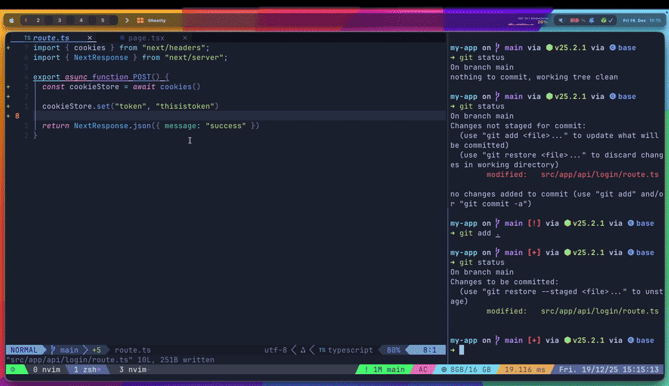

# CommitMate.nvim 🤝

A Neovim plugin that generates AI-powered commit messages following the Commitizen convention using CopilotChat.

## ✨ Features

- 🤖 AI-generated commit messages following Commitizen convention
- 📋 Automatic clipboard copy
- 🚀 Optional lazygit integration with auto-paste
- ⚙️ Configurable behavior
- 🎯 Simple command interface

## 🎬 Demo

Click to watch the full video on GitHub:

[](assets/demo.mp4)

If the GIF doesn't load, use the direct link: [assets/demo.mp4](assets/demo.mp4)

## 📋 Requirements

- Neovim >= 0.8.0
- [nvim-lua/plenary.nvim](https://github.com/nvim-lua/plenary.nvim) (required by CopilotChat)
- [CopilotC-Nvim/CopilotChat.nvim](https://github.com/CopilotC-Nvim/CopilotChat.nvim)
- GitHub Copilot authentication (requires GitHub Copilot subscription)
- Git (already installed on most systems)
- Optional: [lazygit](https://github.com/jesseduffield/lazygit) binary + [kdheepak/lazygit.nvim](https://github.com/kdheepak/lazygit.nvim) (only if using `open_lazygit = true`)

### GitHub Copilot Authentication

Before using CommitMate, you need to authenticate with GitHub Copilot:

1. Ensure you have a [GitHub Copilot subscription](https://github.com/features/copilot)
2. In Neovim, run: `:Copilot auth`
3. Follow the authentication steps (browser login)
4. Enable Copilot Chat in your [GitHub settings](https://github.com/settings/copilot)

## 📦 Installation

### [lazy.nvim](https://github.com/folke/lazy.nvim)

```lua
{
  "ajatdarojat45/commitmate.nvim",
  dependencies = {
    "nvim-lua/plenary.nvim",
    "CopilotC-Nvim/CopilotChat.nvim",
  },
  config = function()
    require("commitmate").setup({
      open_lazygit = false,  -- Auto-open lazygit (default: false)
      ping_message = "CommitMate.nvim is ready 🤝"  -- Custom ping message
    })
  end,
}
```

**Note:** To use lazygit integration, add `"kdheepak/lazygit.nvim"` to dependencies. See [Optional: Lazygit Integration Setup](#optional-lazygit-integration-setup) below.

### [packer.nvim](https://github.com/wbthomason/packer.nvim)

```lua
use {
  "ajatdarojat45/commitmate.nvim",
  requires = {
    "nvim-lua/plenary.nvim",
    "CopilotC-Nvim/CopilotChat.nvim",
  },
  config = function()
    require("commitmate").setup({
      open_lazygit = false,
      ping_message = "CommitMate.nvim is ready 🤝"
    })
  end
}
```

**Note:** To use lazygit integration, add `"kdheepak/lazygit.nvim"` to requires. See [Optional: Lazygit Integration Setup](#optional-lazygit-integration-setup) below.

### [vim-plug](https://github.com/junegunn/vim-plug)

```vim
" Dependencies
Plug 'nvim-lua/plenary.nvim'
Plug 'CopilotC-Nvim/CopilotChat.nvim'

" Optional: only if you want lazygit integration (open_lazygit = true)
" Plug 'kdheepak/lazygit.nvim'

" Plugin
Plug 'ajatdarojat45/commitmate.nvim'

" After plug#end(), add:
lua << EOF
require("commitmate").setup({
  open_lazygit = false,
  ping_message = "CommitMate.nvim is ready 🤝"
})
EOF
```

**Note:** To use lazygit integration, uncomment the `kdheepak/lazygit.nvim` line. See [Optional: Lazygit Integration Setup](#optional-lazygit-integration-setup) below.

### Optional: Lazygit Integration Setup

If you want to use the lazygit integration feature (`open_lazygit = true`), you need to install the `lazygit` binary on your system:

```bash
# macOS
brew install lazygit

# Ubuntu/Debian
sudo add-apt-repository ppa:jesseduffield/lazygit
sudo apt-get update
sudo apt-get install lazygit

# Or download from: https://github.com/jesseduffield/lazygit/releases
```

After installation, enable it in your config:

```lua
require("commitmate").setup({
  open_lazygit = true,
})
```

## 🚀 Usage

### Commands

```vim
" Generate AI commit message for staged changes
:CommitMate

" Test if plugin is loaded
:CommitMate ping
```

### Basic Workflow

1. Stage your changes:
   ```bash
   git add .
   ```

2. Run the command:
   ```vim
   :CommitMate
   ```

3. The plugin will:
   - Generate a commit message using AI
   - Copy it to your clipboard
   - Save it to `.git/COMMIT_EDITMSG`

4. Use the commit message:
   - Paste anywhere with `Ctrl+V`/`Cmd+V`
   - Run `git commit` (automatically uses `.git/COMMIT_EDITMSG`)
   - Or enable lazygit integration for auto-commit workflow

### Configuration Options

```lua
require("commitmate").setup({
  -- Auto-open lazygit with pre-filled commit message
  open_lazygit = false,  -- default: false
  
  -- Custom ping message
  ping_message = "CommitMate.nvim is ready 🤝"  -- default: "CommitMate.nvim is ready 🤝"
})
```

#### Default Behavior (open_lazygit = false)

By default, the commit message will be:
- ✅ Copied to clipboard (paste anywhere with `Ctrl+V`/`Cmd+V`)
- ✅ Saved to `.git/COMMIT_EDITMSG` (auto-loaded by `git commit`)

This allows you to use your preferred git workflow.

#### With lazygit Integration (open_lazygit = true)

For automatic lazygit workflow with pre-filled commit message:

```lua
require("commitmate").setup({
  open_lazygit = true,
})
```

With this setting, the plugin will:
- Open lazygit automatically
- Pre-fill the commit form with the generated message
- Let you review and commit with one keypress

## 🎯 Keybinding Examples

Add these to your config for quick access:

```lua
-- lazy.nvim
{
  "ajatdarojat45/commitmate.nvim",
  keys = {
    { "<leader>gc", "<cmd>CommitMate<cr>", desc = "Generate commit message" },
  },
  -- ... rest of config
}

-- Or in your general keymaps
vim.keymap.set("n", "<leader>gc", "<cmd>CommitMate<cr>", { desc = "Generate commit message" })
```

## 🙏 Credits

Built with:
- [CopilotChat.nvim](https://github.com/CopilotC-Nvim/CopilotChat.nvim) - AI chat integration
- [lazygit](https://github.com/jesseduffield/lazygit) - Terminal UI for git